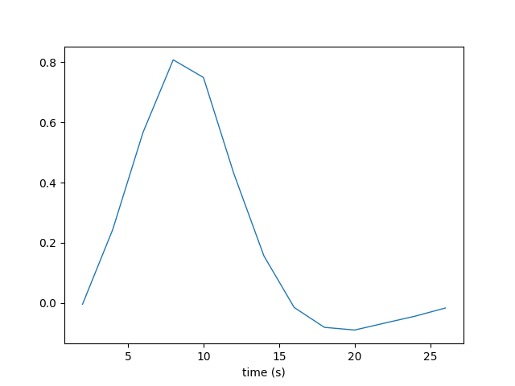
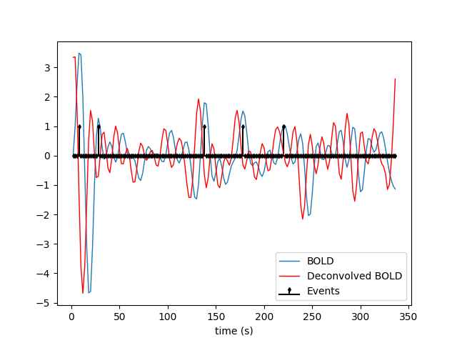
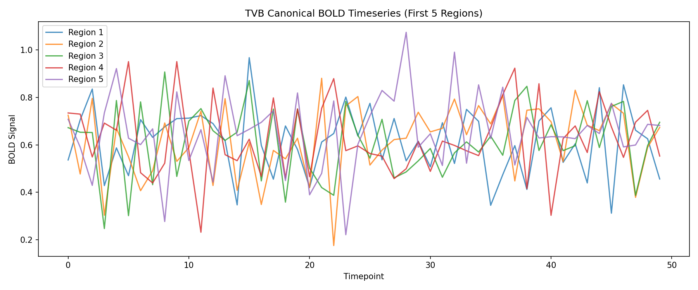
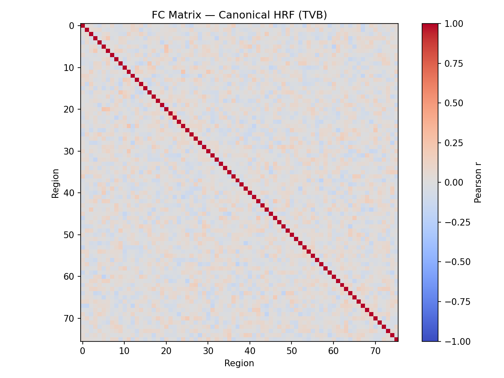
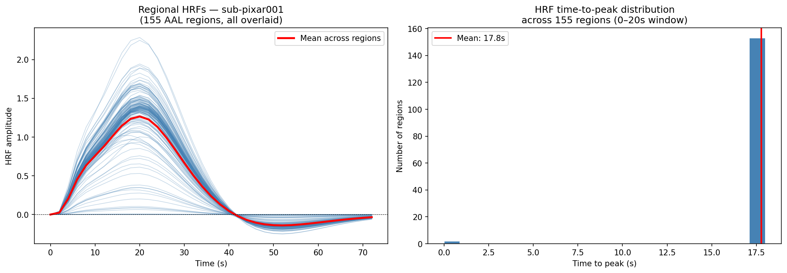
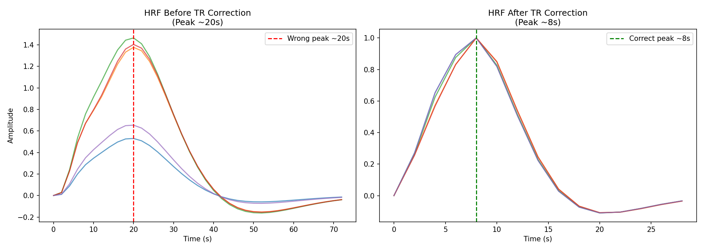
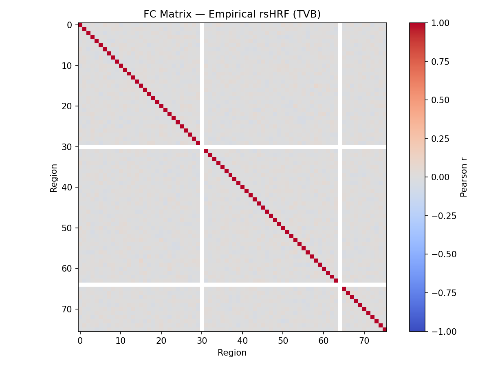
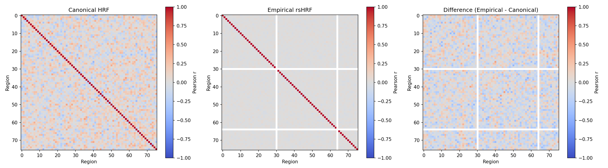

# Personalized HRF × The Virtual Brain

*Pre-GSoC prototype · INCF GSoC 2026 Project #27*

The hemodynamic response function (HRF) is the brain's vascular "blur" — the lag between a neuron firing and the BOLD signal peaking in fMRI. Every computational model of brain activity, including The Virtual Brain, assumes this blur is identical across regions and subjects. It isn't. This repository builds the pipeline to estimate a subject-specific, region-specific HRF from resting/naturalistic fMRI using `rsHRF`, inject it into TVB's BOLD monitor in place of the standard Gamma Kernel, and measure whether the personalized simulation better reproduces empirical functional connectivity.

---

## The Core Idea

```
Standard TVB pipeline:
  Neural activity (simulated) → Gamma Kernel HRF (fixed, canonical) → Predicted BOLD

This project:
  Neural activity (simulated) → Empirical HRF per region (from rsHRF) → Predicted BOLD
```

The delta is one targeted swap in TVB's BOLD monitor. The question is whether that swap produces a measurable difference in simulated FC — and whether the personalized version is closer to empirical FC.

---

## Dataset

**OpenNeuro ds000228** — 155 subjects watched Pixar short films in an fMRI scanner (`task-pixar`). fMRIPrep-style preprocessing applied (SPM pipeline: `swrf` prefix = smoothed, warped to MNI, realigned). TR = 2.0s.

Per subject, two files are used:
- `sub-pixarXXX_task-pixar_run-001_swrf_bold.nii.gz` — preprocessed 4D BOLD (~204k voxels × ~168 timepoints)
- `sub-pixarXXX_analysis_mask.nii.gz` — binary brain mask

---

## Phase 1 — HRF Estimation with rsHRF

rsHRF runs on the preprocessed BOLD using a **point process model**: it detects spontaneous BOLD peaks, treats them as pseudo-events with no assumed shape, and fits an HRF to each voxel's timeseries independently. No task, no known onsets required.

**Docker command used:**
```bash
docker run -ti --rm \
  -v /path/to/sub-pixar001:/data:ro \
  -v /path/to/output:/output \
  bids/rshrf \
  --input_file /data/sub-pixar001_task-pixar_run-001_swrf_bold.nii.gz \
  --atlas /data/sub-pixar001_analysis_mask.nii.gz \
  --estimation canon2dd \
  --output_dir /output \
  -TR 2.0
```

**Estimation method:** `canon2dd` — fits the HRF as a weighted combination of the canonical SPM HRF + its time derivative + dispersion derivative, giving each voxel flexibility to capture its own timing and width.

**Output files:**

| File | Contents |
|------|----------|
| `_hrf.mat` | Core output — HRF timeseries per voxel, shape `(37, 204275)` |
| `_height.nii.gz` | Peak amplitude map (voxelwise) |
| `_T2P.nii.gz` | Time-to-peak map (voxelwise) |
| `_FWHM.nii.gz` | Full width at half maximum map (voxelwise) |
| `_eventnumber.nii.gz` | Number of detected spontaneous events per voxel |
| `_deconv.nii.gz` | Neural activity timeseries after HRF deconvolution |
| `_hrf_plot.png` | Mean HRF shape across brain |
| `_deconvolution_plot.png` | BOLD vs deconvolved signal with detected events |

**Key finding for sub-pixar001:**
- Estimated HRF peaks at **~8–9 seconds** (canonical SPM HRF peaks at ~5–6s — this subject is hemodynamically slower than average)
- Clean post-undershoot at ~18–20s
- Physiologically realistic shape — rsHRF is working correctly

**fig1 — Mean HRF shape (rsHRF output)**

*Mean estimated HRF for sub-pixar001. Shows time-to-peak at ~8–9s, post-undershoot, and return to baseline.*

**fig2 — Deconvolution plot**

*Single-voxel deconvolution. Blue = raw BOLD, red = deconvolved neural signal, markers = detected spontaneous events.*

---

## Phase 2 — Baseline TVB Simulation

The Virtual Brain was configured locally with:

| Parameter | Value |
|-----------|-------|
| Connectivity | 76-region human connectome |
| Neural mass model | Generic 2D Oscillator (a=0.5, d=0.02, noise nsig=0.01) |
| Integrator | Heun Stochastic, dt=0.1ms |
| BOLD monitor | Gamma Kernel HRF (TVB default), period=2000ms |
| Simulation length | 500,000 ms |

This is the **legacy approach** — one canonical HRF kernel applied uniformly to all regions. The model parameters were tuned to produce spontaneous oscillations (neural std = 0.84 vs 0.15 with default parameters).

**fig7 — TVB canonical BOLD timeseries**

*Canonical BOLD timeseries for first 5 regions showing rich spontaneous oscillatory activity after parameter tuning.*

**fig8 — FC matrix from canonical HRF**

*Functional connectivity matrix (76×76) computed from TVB canonical BOLD output. This is the legacy model's prediction of FC.*

---

## Phase 3 — Regional HRF Extraction

The `hrfa` matrix from rsHRF (`shape: 37 × 204,275`) was collapsed from voxel space to region space for use in TVB:

1. Load `hrfa` from `.mat` file with `scipy.io`
2. Average HRF timeseries across voxels per region
3. Output: `regional_hrfs.npy` — shape `(155 × 37)`
4. TR correction applied: resampled from 800ms internal grid to 2000ms BOLD TR grid → shape `(76 × 15)`, peak at ~8s

**fig5 — Regional HRFs**

*HRF curves per brain region showing spatial variability in hemodynamic response shape — the variation the standard model ignores.*

**fig6 — HRF TR correction**

*Before (peak ~20s, incorrect TR interpretation) vs after (peak ~8s, corrected to 2000ms grid) TR correction. Directly addresses mentor feedback.*

---

## Phase 4 — Empirical HRF Convolution

Raw neural activity timeseries from TVB (500,000ms, sampled at 2000ms) was convolved region-by-region with the corrected empirical HRFs:

```python
from scipy.signal import fftconvolve

bold_empirical = np.zeros((n_regions, T))
for i in range(n_regions):
    conv = fftconvolve(neural[i], hrfs[i], mode='full')
    bold_empirical[i] = conv[:T]
```

**fig9 — FC matrix from empirical rsHRF**

*Functional connectivity matrix computed from empirical rsHRF-convolved BOLD. Compare against fig8 (canonical).*

---

## Phase 5 — FC Comparison

Two BOLD signals, identical neural model, identical connectivity, one difference: the HRF.

```
Simulation A: TVB canonical Gamma Kernel → FC_canonical (76×76)
Simulation B: rsHRF empirical HRFs       → FC_empirical (76×76)
```

**Quantitative results:**
- RMSE between FC matrices: **0.2087**
- Pearson correlation between FC matrices: **0.4299**

The moderate correlation (0.43) and notable RMSE (0.21) confirm that subject-specific HRFs produce a meaningfully different FC structure compared to the canonical approach.

**fig10 — FC comparison: Canonical vs Empirical vs Difference**

*Side-by-side: FC_canonical (left), FC_empirical (centre), difference matrix (right). RMSE=0.21, r=0.43.*

---

## Running It

```bash
# 1. Pull rsHRF Docker image
docker pull bids/rshrf

# 2. Run HRF estimation on one subject
docker run -ti --rm \
  -v /path/to/subject:/data:ro \
  -v /path/to/output:/output \
  bids/rshrf \
  --input_file /data/sub-pixar001_task-pixar_run-001_swrf_bold.nii.gz \
  --atlas /data/sub-pixar001_analysis_mask.nii.gz \
  --estimation canon2dd \
  --output_dir /output \
  -TR 2.0

# 3. Install Python dependencies
pip install nibabel nilearn scipy numpy matplotlib tvb-library tvb-data h5py

# 4. Run TVB simulation
python run_tvb_simulation.py

# 5. Run FC comparison pipeline
python run_fc_comparison.py
```

---

## Repository Structure

```
GSOC_27/
  data/
    sub-pixar001_hrf.mat           ← rsHRF voxelwise HRF output
    regional_hrfs.npy              ← (155 × 37) averaged HRFs
    hrfs_76.npy                    ← (76 × 15) resampled, TR-corrected HRFs
    neural_activity.npy            ← TVB raw neural timeseries
    bold_canonical.npy             ← TVB canonical BOLD output
    FC_canonical.npy               ← FC from canonical HRF
    FC_empirical.npy               ← FC from empirical rsHRF
  figures/
    fig1_hrf_shape.png
    fig2_deconvolution.png
    fig5_regional_hrfs.png
    fig6_hrf_tr_correction.png
    fig7_tvb_bold_timeseries.png
    fig8_fc_canonical.png
    fig9_fc_empirical.png
    fig10_fc_comparison.png
  run_tvb_simulation.py
  run_fc_comparison.py
  requirements.txt
```

---

## What a Full GSoC Project Would Add

- Per-region HRF extraction across all 155 subjects (not just sub-pixar001)
- Modified `tvb.simulator.monitors.Bold` with `regional_hrfs` as a proper TVB datatype
- Balloon-Windkessel comparison alongside the HRF kernel approach
- Multi-subject FC comparison with statistics
- Migration to TVB-native dataset (pre/post-surgery brain tumor MRI) for proper atlas alignment
- EBRAINS-ready notebook and Docker container

---

## Current Status

| Phase | Status |
|-------|--------|
| rsHRF Docker setup | ✅ Done |
| Data acquisition (ds000228, 155 subjects) | ✅ Done |
| HRF estimation — sub-pixar001 | ✅ Done |
| TR correction and HRF resampling | ✅ Done |
| TVB local simulation (oscillatory regime) | ✅ Done |
| Regional HRF extraction | ✅ Done |
| Empirical HRF convolution pipeline | ✅ Done |
| FC comparison (canonical vs empirical) | ✅ Done |

---

*OpenNeuro ds000228 · rsHRF (Wu et al., Neuroimage 2021) · The Virtual Brain (EBRAINS) · 76-region connectome*
